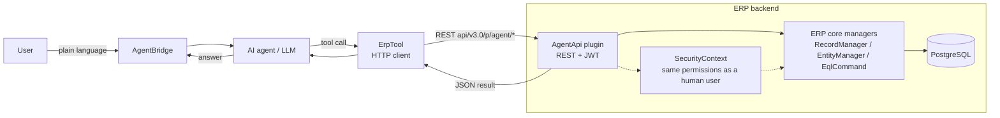

# AI Integration

This page explains how an AI agent drives the ERP. It is the part this fork adds on top of the
base ERP platform.

## The idea

A person talks to an AI agent in plain language ("deliver order SO-1042 and invoice it"). The
agent turns that into a small set of structured calls to the ERP. It reads the data structure
first, then works on the data: search, create, update, link records, and run whole business
operations in one step.

The agent is **not** a super-user and it is **not** trusted. Every call it makes runs as a normal
ERP user, through the same API, with the same permissions and the same validation. If the user
behind the agent cannot delete a record, neither can the agent.

## The pieces

| Piece | What it is |
|---|---|
| **AgentApi** | A plugin inside the ERP. It exposes a small REST API (`api/v3.0/p/agent/*`) and authenticates with a normal ERP JWT. |
| **ErpTool** | A thin HTTP client that the agent calls. It turns a tool call into an HTTPS request to the AgentApi and returns the JSON result. |
| **AgentBridge** | The chat front-end. The user types here; the agent (LLM) reads the tool list and decides which tool to call. |

## What the agent can do

- **Read the schema.** List entities and fields, so the agent knows the shape of the data before
  it touches it.
- **Search.** Run queries and get records back as JSON.
- **Write.** Create and update single records.
- **Run composed operations.** One call does a multi-step business action — for example
  "deliver a sales order" creates the delivery, moves the stock, and updates the order lines.

## Security model

- The agent authenticates with a normal ERP **JWT** tied to a real user account.
- Every read and write goes through the ERP's own `SecurityContext`. Permissions are checked the
  same way they are for a person using the web UI.
- The agent never supplies its own user id, role, or tenant. The identity comes from the JWT.
- Composed operations are checked step by step, so a partial permission cannot slip through.

## Dual-target build

The AgentApi plugin is built in two flavours from the same source:

- **Fork flavour** — builds against `AI.Erp.*` (this repository).
- **Vendor flavour** — builds against the published `WebVella.Erp.*` NuGet packages.

The flavour is selected at build time, and the source uses `using` aliases so the same code
compiles against either. This keeps the plugin usable on the fork and on a stock vendor install.
