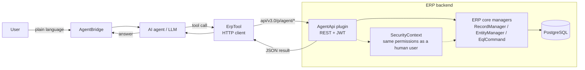

# Third-Party Libraries

This file lists the third-party libraries used by the project, and documents the AI-agent
integration layer that sits on top of the ERP core.

All libraries keep their own license. The project itself is Apache-2.0.

## .NET packages (NuGet)

### Core (`AI.Erp`)

| Library | Version | Used for |
|---|---|---|
| Npgsql | 9.0.4 | PostgreSQL data provider |
| Newtonsoft.Json | 13.0.4 | JSON serialization |
| AutoMapper | 14.0.0 | Object-to-object mapping |
| CsvHelper | 33.1.0 | CSV import and export |
| Ical.Net | 5.2.3 | Calendar / ICS handling |
| Irony.NetCore | 1.1.11 | Parser generator (used by the EQL engine) |
| MimeMapping | 4.0.0 | MIME type mapping |
| Storage.Net | 9.3.0 | File storage abstraction |
| System.Drawing.Common | 10.0.10 | Image handling |

### Web and rendering (`AI.Erp.Web`)

| Library | Version | Used for |
|---|---|---|
| Microsoft.CodeAnalysis.CSharp (+ Common, .Scripting, .Workspaces) | 5.3.0 | Roslyn: dynamic C# compilation for code hooks |
| CS-Script | 4.14.9 | C# scripting engine |
| HtmlAgilityPack | 1.12.4 | HTML parsing |
| WebVella.TagHelpers | 1.8.2 | The WebVella tag-helper library |
| Wangkanai.Detection | 8.20.0 | Device and browser detection |
| Microsoft.AspNetCore.Mvc.Razor.RuntimeCompilation | 10.0.8 | Runtime Razor compilation |
| System.IdentityModel.Tokens.Jwt | 8.18.0 | JWT creation and validation |
| Microsoft.Extensions.FileProviders.Embedded | 10.0.8 | Embedded resource file provider |

### Host and sites (`AI.Erp.Site*`)

| Library | Version | Used for |
|---|---|---|
| Microsoft.AspNetCore.Mvc.NewtonsoftJson | 10.0.8 | Newtonsoft.Json integration for MVC |
| Microsoft.AspNetCore.Authentication.JwtBearer | 10.0.8 | JWT bearer authentication |
| Microsoft.Web.LibraryManager.Build | 3.0.71 | Client-side library restore at build |
| morelinq | 4.4.0 | Extra LINQ operators |

### Blazor WebAssembly client

| Library | Version | Used for |
|---|---|---|
| Microsoft.AspNetCore.Components.WebAssembly | 10.0.8 | Blazor WebAssembly framework |
| Microsoft.AspNetCore.Components.WebAssembly.Authentication | 10.0.8 | Client-side authentication |
| Microsoft.Extensions.Http | 10.0.8 | HttpClient factory |
| Blazored.LocalStorage | 4.5.0 | Browser local storage |

### Plugins

| Library | Version | Used for |
|---|---|---|
| MailKit | 4.16.0 | Email (Mail plugin) |

## Client-side (browser) libraries

The admin UI loads its browser libraries through LibraryManager
(`Microsoft.Web.LibraryManager.Build`) into `wwwroot` at build time. These are not NuGet
packages. They include the `webvella-core` front-end bundle, Bootstrap, Angular, CKEditor,
moment.js and Chart.js, among others.

## AI-agent integration

This project adds a layer that lets an AI agent control the ERP. The layer has three parts that
work together. The agent never touches the database directly. Every call runs as a normal ERP
user, so the same permissions, rules and checks that protect the data from people also apply to
the agent.

1. **AgentApi plugin** (this repository, `AI.Erp.Plugins.AgentApi`) — a server-side plugin. It
   exposes the ERP record, entity and EQL managers over a JWT-secured REST API
   (`api/v3.0/p/agent/...`). It also adds composed business operations (place an order, deliver
   it, invoice it, collect a payment, the full purchase-to-pay cycle), reports (sales by
   customer or product, receivables aging), and a headless setup surface (status and
   re-provision).

2. **ErpTool** (separate repository, `Graphene-Lab/ErpTool`) — the agent-side tool. It is a
   thin HTTP client that calls the AgentApi REST endpoints. It knows only the REST contract, not
   the backend internals.

3. **AgentBridge** — the companion program where a person talks to the AI agent in plain
   language. The agent decides which ErpTool method to call. ErpTool calls the AgentApi. The ERP
   performs the operation.

### How a request flows

### What the agent can do

- Read the schema: which entities exist, which fields and relations they have.
- Query records with EQL.
- Create, update and delete records.
- Run composed operations: place an order, deliver it, invoice it, collect a payment, or the
  full purchase-to-pay cycle.
- Read reports: sales by customer or product, receivables aging.
- Check and re-apply the ERP setup (headless install).

### Dual-target note

The AgentApi plugin is written once and built for two targets: the fork (`AI.Erp.*`) and the
upstream vendor (`WebVella.Erp.*`). The switch is done with source-level `using` aliases
(`ErpCore`, `ErpApi`, `ErpEql`), so the source never writes a core namespace as text. The
vendor form of the plugin is `WebVella.Erp.Plugins.AgentApi`. See
[`AI.Erp.Plugins.AgentApi/ARCHITECTURE.md`](AI.Erp.Plugins.AgentApi/ARCHITECTURE.md) for the
full explanation.
